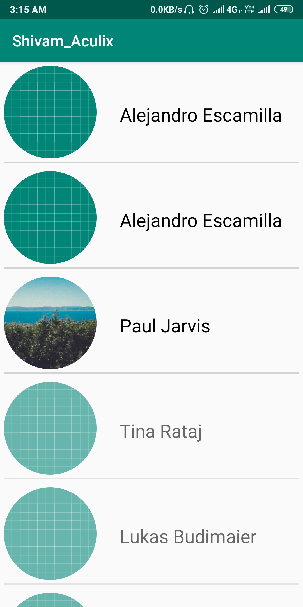

# MVVM
This is a basic implementation of MVVM (Model View ViewModel) architecture in andorid which uses pagination as well. The use of picsum.photos is done as the backend REST API which is accessed by Retrofit library.

# Screenshots

#### This screen shows the collection of all the images fetched from the webpage in pair of three. New images are only loaded when new page is requested

